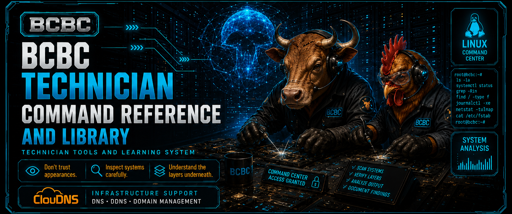
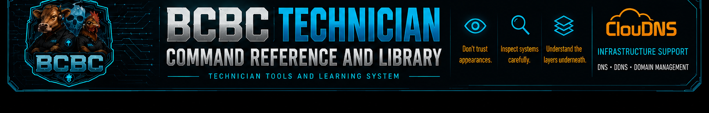

# BCBC Technician Command Reference and Library

A technician-first Linux admin command reference site built for beginners, self-learners, and working support technicians who need fast access to useful commands without digging through scattered notes, old bookmarks, or bloated documentation.

This project focuses on clean command packs, searchable workflows, and simple flat-file import/export so useful knowledge can be shared, expanded, and reused without locking everything into a heavy platform. The goal is to make Linux learning and day-to-day troubleshooting more approachable while still being practical enough for real technician work.

## What it does

- Organizes Linux commands into searchable packs
- Supports flat-file import and export for easy sharing
- Lets users build and extend their own command libraries
- Keeps the interface simple, fast, and beginner-friendly
- Helps turn useful commands into reusable learning material
- Stand along car run on any plafrorm with a WWW Browser or on any webserver platrorm including python instance or flask

## Current features

- Search across all packs
- Per-pack filtering
- Tag filtering
- Copy-ready command cards
- Flat-file pack preview
- Import and append support for pack files
- Export tools for sharing and reuse

## Why this exists

A lot of Linux help is either too advanced, too scattered, or too poorly organized for people who are still learning or for technicians who need quick answers under pressure. This project is meant to bridge that gap with a cleaner, more modular approach that is easy to understand, easy to expand, and useful in the real world.

## Project direction

This site is part of a broader BCBC technician tools and learning system focused on practical support tools, guided learning, AI-assisted workflows, and beginner-friendly technical education.

## Status

Active working prototype with live search, pack management, and ongoing usability improvements.

1. Extract the zip file.
2. Open `index.html` in a web browser.
3. Use the built-in starter packs.
4. Import/export `.bcbc` flat-file packs as needed.

No Apache, database, backend, npm, Python, or internet access is required for normal use.

## Optional Apache deployment

Copy the folder to your Apache web root, for example:

```bash
sudo mkdir -p /var/www/html/bcbc-cheatsheets
sudo rsync -a --delete ./ /var/www/html/bcbc-cheatsheets/
```

Then open:

```text
http://YOUR-SERVER/bcbc-cheatsheets/
```

On Baxter this would typically be:

```text
http://192.168.0.225/bcbc-cheatsheets/
```

## Flat-file format

```text
PACK|id|Title|Description|Version
ITEM|Card title|command here|Plain-English explanation|Safety note or reminder|tag1,tag2,tag3
```

Blank lines and lines starting with `#` are ignored.

## Starter packs included

- Working With Drives
- Terminal Basics
- Search With grep and find
- Network Quick Checks
- Services and Logs

## Credits

BCBC Technician Tools and Learning System.
Ideas, design, and concepts by William James Franza with assistance from ChatGPT.
AI-related collaboration credit: Mikey_LikesIT (William J. F.) and ChatGPT.
No OpenAI endorsement is implied.


## Optional graphics

This version is graphics-ready. Put images in `assets/` using these names:

```text
assets/bcbc-logo.png
assets/bcbc-header.png
assets/bcbc-footer.png
```

Missing images are automatically hidden, so the site still works without them.


## V3 Final graphics package

This zip already includes recommended graphics in the live asset slots:

```text
assets/bcbc-logo.png
assets/bcbc-header.png
assets/bcbc-footer.png
```

Included extras are here:

```text
assets/extras/
```

That folder includes:
- alternate header graphics
- alternate logo graphic
- `bcbc-cheatsheets-rotator.gif` (small animated GIF cycling through the cheat-sheet banners)

### Current recommended mapping

- `bcbc-logo.png` = square BCBC mascot logo
- `bcbc-header.png` = main wide cheat-sheet banner
- `bcbc-footer.png` = wide footer/banner art


## V3.1 layout update

This version changes the hero layout to match William's preferred placement:

- wide header banner across the top of the hero section
- shield logo moved to the right-side visual panel
- page title updated to `Linux Administrator Cheat Sheets`
- modular/import wording moved into the supporting lead text


## V3.2 import preview fix

The import/export section now follows the selected pack.

When a user clicks:
- Working With Drives
- Terminal Basics
- Search With grep and find
- Network Quick Checks
- Services and Logs

…the flat-file preview updates to show that current pack instead of always showing the drives example.


## V3.3 export/share controls

The flat-file preview section now includes:
- `Export current pack` — downloads the selected pack as a `.bcbc` file
- `Copy pack text` — copies the selected pack text to the clipboard
- `Share by email` — opens the default email client with the pack text in the message body

Because browsers do not reliably allow local static pages to attach files to email automatically, the recommended email workflow is:
1. Export current pack
2. Attach the `.bcbc` file manually


## V3.4 smarter import and duplicate-pack fix

Fixes:
- Imported packs now override built-in packs with the same `PACK|id|...`.
- Duplicate visible pack buttons with the same ID are prevented.
- This fixes the bug where two same-ID packs both highlighted but only one displayed.

New behavior:
- Paste a full `PACK|...` block to import or replace a pack.
- Paste loose `ITEM|...` lines to append them to the currently selected pack.
- Duplicate item title/command pairs are skipped.


## V3.6 pack management

Changes:
- Search pack baseline now includes egrep / grep -E extended regex examples.
- Added `Export all` to back up every visible pack into one `.bcbc` file.
- Added `Check packs` to find common issues such as duplicate item title/command pairs, missing commands, missing titles, and duplicate visible pack IDs.
- Added local pack delete workflow:
  - pick a local imported/modified pack
  - delete only that local pack/override
  - built-in pack comes back automatically if the deleted local pack was overriding it
- `Reset local` now requires typing `RESET` and is no longer labeled like a harmless reload.
- Email sharing still sends the current pack only through `mailto:` because attaching files from a local static webpage is not reliable.


## V3.7 final-safe

- Graphics are included directly in the full package under `assets/`.
- The normal sidebar no longer has a reset/reload button that wipes user-added local packs.
- `Export all` is the safe full-backup method.
- `Delete selected local pack` is the normal cleanup method.
- Imported/modified packs are browser-local; export before switching browsers or clearing browser data.
---

## New in v4.0

- Dynamic pack loading from data/packs/
- Modular .bcbc pack architecture
- Automatic pack discovery using index.json
- Python Local Utility Helpers pack
- BCBC Admin Workstation Toolkit pack
- Expanded Linux admin and defensive operations references
- Improved portability for GitHub Pages, LAN servers, and offline USB deployments
---

## Sharing command packs

If you create a useful pack and want to share it, open a GitHub Issue and attach your exported `.bcbc` file, or paste the flat-file pack text into the issue body. Clean, beginner-friendly, and technician-useful packs may be reviewed and added to the project.

ChatGPT and I would like to encourage any and all users of this tool to share you additions and changes to what we have provided as an example top get you started so that we may all benefit from the experiences and collective wisdom and experience of all of you.  This framework could just as easily serve as a price list a catalog or a repository of whatever it is you would like to use it for and is released free to you liensed under MIT License Rules.  Enjoy everybody and thank you.  Peace!! WJF&ChatGPT

---

## Infrastructure Support

Special thank you to **ClouDNS** for supporting reliable DNS infrastructure for BCBC projects.


---

- 

